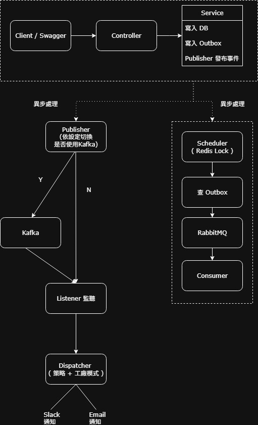

# TaskManager

基於 Spring Boot 的事件驅動任務系統，整合 JWT 驗證、通知機制、分散式鎖、RabbitMQ、Redis、Spring Cloud Config 、主從資料庫讀寫分離等，並透過 Docker 容器化

## 簡易流程圖

##  專案技術
- **模組化架構設計**：以職責導向劃分模組（如 notification、scheduler、aop），提高維護性與可讀性
- **事件驅動通知系統**：透過自定義事件與監聽器，實現任務事件與通知邏輯的完全解耦
- **分散式鎖（Redisson）**：確保排程任務或併發操作安全
- **RabbitMQ 整合**：具備 Outbox pattern 發送、手動 ACK / NACK、DLQ 死信處理與 Routing Key 分類
- **主從資料庫架構**：讀寫分離配置，降低主庫壓力，使用 AOP 控制
- **Spring Cloud Config**：集中管理系統設定
- **操作紀錄與異常日誌 AOP**：自動記錄用戶操作與錯誤紀錄

## 設計模式

強調可維護性與擴充性，持續導入多種設計模式：

- 策略模式 Strategy Pattern  
  將通知通道 Email、Slack 等，封裝為獨立策略，讓通知邏輯根據參數動態切換

- 工廠模式 Factory Pattern  
  建立策略工廠，集中管理並回傳不同策略實作

- Outbox 模式 Outbox Pattern  
  為了解決分散式系統中資料庫與訊息系統的一致性問題，導入 Outbox 模式  
  當系統操作資料庫時，同步將事件寫入 Outbox 表，再由排程發送訊息至 RabbitMQ，確保資料與事件發送具備原子性

- 觀察者模式 Observer Pattern  
  利用 Spring 的事件機制來實現事件的發布與監聽  
  發布端透過 ApplicationEventPublisher 發送事件
  監聽端則使用 @EventListener 標註的方法來接收事件
  當任務建立等事件發生時，所有註冊的監聽器會被自動通知

## 資料庫讀寫分離
由自定義的 `DataSourceAspect` 以 @Annotation 切換資料源  
- `master`：寫入操作
- `slave`：讀取操作  

## 系統架構

`controller/`：負責接收任務相關 API 請求（透過 Swagger 測試）  
`service/`：商業邏輯
`scheduler/`：任務狀態檢查與 Outbox 推送的排程任務  
`notification/`：通知系統模組，內含事件發布、策略選擇、發送通道  
`producer/` / `consumer/`：RabbitMQ 生產者與消費者邏輯  
`config/`：JWT、Redis、RabbitMQ、多資料源、分散式鎖等配置  
`aop/`：切面  
`dao/` / `mapper/`：MyBatis 操作資料庫
`exception/`：全域例外處理，統一回傳格式給前端
`utils/`：工具類，例如 Redis 鎖工具、 JWT 驗證工具 等  
`entity/`：DTO、Enum 與資料模型  
`filters/`：JWT 授權攔截器 

## 使用技術
- Spring Boot
- Spring Security + JWT
- Spring AOP 方法攔截與日誌
- MySQL 主從架構（讀寫分離）  
- MyBatis
- Redis
- Redisson 分布式鎖
- RabbitMQ 非同步訊息 
- Spring Cloud Config 配置集中管理  
- Swagger/OpenAPI API 文件生成  
- BCrypt 密碼加密  
- SLF4J + Logback 日誌  
- Docker + docker-compose 容器化部署
- 多個設計模式： Strategy Pattern 、 Factory Pattern 、 Outbox Pattern 、 Observer Pattern ...等

## 專案包含三個主要部分：

[TaskManager](https://github.com/YuChengLin0110/Taskmanager)：主應用程式 Spring Boot

[ConfigServer](https://github.com/YuChengLin0110/TaskmanagerConfigServer)：Spring Cloud Config Server 集中管理多環境設定 

[TaskManagerConfigRepo](https://github.com/YuChengLin0110/TaskManagerConfigRepo)：儲存所有環境設定檔的 Git 倉庫

### 專案目錄結構
你的資料夾/

├── docker-compose.yml

├── .env                    # 機密資料環境變數

├── taskmanager/            # 主應用程式 

│   └── Dockerfile

├── config-server/          # Config Server 

│   └── Dockerfile

請在專案根目錄下建立 .env 檔案， 可參考 .env.example

### 建置流程：  
請先在本地建置好 taskmanager 與 config-server
1. 本地打包 jar，執行 `mvn clean package -DskipTests` 

2. 使用 docker-compose 在專案根目錄啟動 `docker-compose up --build`

啟動後包含以下容器：  
- Config Server  
- TaskManager 主應用
- Redis  
- RabbitMQ
- MySQL Master & Slave
- Prometheus  
- Grafana
